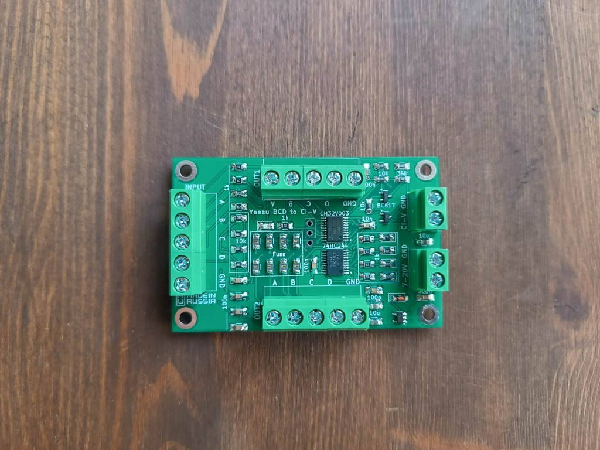
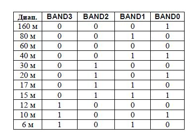
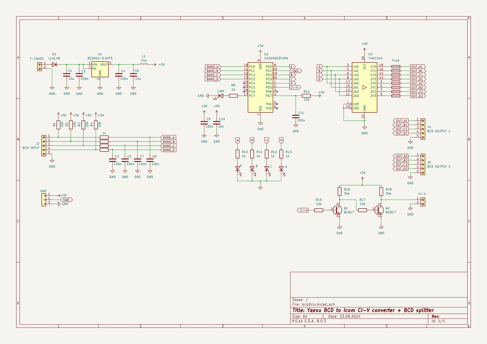

## Converter Yaesu BCD to Icom CI-V band data

A simple board is based on risk-v MCU CH32V003F4P6. 

* Dimensions: 70*45 mm
* Consumption current: 20 mA
* Power supply: from 7 to 20VDC
* CI-V address: 0x94

More information - https://ra0sms.com/bcd2civ

### Yaesu BCD band data:

### Schematic:

