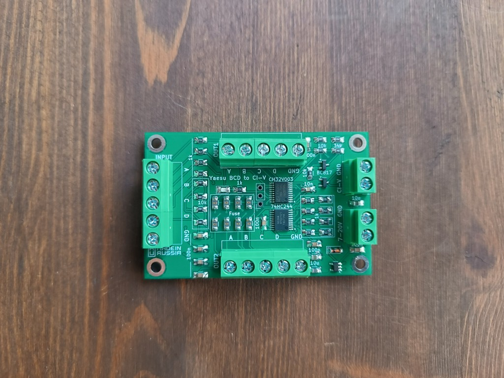
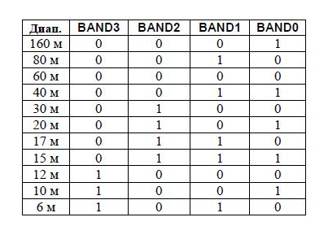
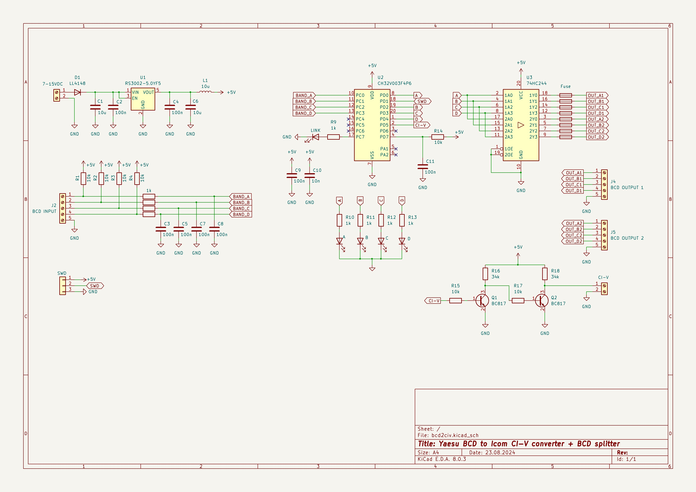

## Converter Yaesu BCD to Icom CI-V band data

A simple board is based on risk-v MCU CH32V003F4P6. 

* Dimensions: 70*45 mm
* Consumption current: 20 mA
* Power supply: from 7 to 20VDC
* CI-V address: 0x7A
* Baud rate for EW3MM tuner: 9600 kb/s
* Baud rate for DJ0ABR controller: 4800 kb/s

[Firmware for EU3MM tuner](code/obj/bcd2civ_tuner.hex)
[Firmware for DJ0ABR controller](code/obj/bcd2civ_dj0abr.hex)

More information - https://ra0sms.com/bcd2civ

### Yaesu BCD band data:

### Schematic:

